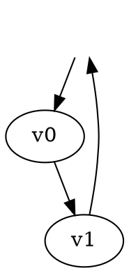

# GammaLoop DOT input format

GammaLoop imports Feynman graphs from Graphviz `digraph` files. The generic DOT
syntax and parser behavior are provided by [Linnet](../crates/linnet/README.md);
this page records the GammaLoop physics contract.

## Graph shape and half-edges



Use `digraph NAME { ... }`. Edges are directed in the DOT file and define the
underlying momentum-flow orientation. A node with `style=invis` is interpreted
as a dangling external half-edge: invisible-node → vertex is incoming, and
vertex → invisible-node is outgoing. An edge between two invisible nodes is
invalid. Use one shared `ext [style=invis]` node for all external legs to keep
input compact; each connection still creates a separate dangling half-edge. Keep the
shared node otherwise attribute-free: attributes on a dangling node are merged
into every external edge, so put `particle`, `num`, and other per-leg data on
the edge.

Numeric ports (`vertex:0`) fix half-edge indices; an edge `id=1` fixes its
edge index. These are separate index spaces. Assign only the indices that matter
for momentum or numerator references; the parser assigns all omitted indices
automatically. Either endpoint of an internal edge can be indexed independently.
In the example, only one half-edge and one edge are explicitly indexed. Supplied
indices must be unique within their index space and in range.

## GammaLoop attributes

Graph attributes:

- `num`: global numerator factor (default `1`).
- `overall_factor`: Symbolica factor multiplying the graph (default `1`).
- `projector`, `params`, `group_id`, and `is_group_master`: optional advanced
  fields used by imported states and grouped graphs. `pole_part` marks a pole-part
  component for UV processing.

Node attributes:

- `int_id`: UFO interaction identifier. Supply it when incident particles do not
  uniquely identify a vertex rule; quote string values (`int_id="V_134"`).
- `num`: explicit vertex numerator, overriding the model rule.
- `dod`: degree-of-divergence override.

Edge attributes:

- `particle`: model particle name, such as `a`, `d`, `d~`, `g`, or `ghG`.
- `pdg`: alternative particle lookup by signed UFO PDG code. For fermions, the
  sign and edge orientation must form a consistent fermion flow around closed
  loops and along open fermion lines.
- `dir`: preserve the DOT arrow orientation for this edge. The current parser
  derives fermion orientation from the signed particle when this field is absent;
  use explicit arrows and signed `particle`/`pdg` values consistently.
- External momentum labels are not a current GammaLoop physics attribute. Older
  wiki examples use `mom`; current imported and generated graphs identify external
  particles with the edge `particle`/`pdg` and half-edge ports.
- `name`: optional edge name. Names make exported edge labels stable; if omitted,
  GammaLoop assigns a generated name.
- `mass`: Symbolica mass override.
- `propagator` is a legacy wiki attribute and is currently ignored by the
  GammaLoop DOT physics parser. Propagator tensors come from the active model.
- `lmb_id`: marks an edge in a chosen loop-momentum basis. If omitted, GammaLoop
  chooses a deterministic valid basis.
- `num`: explicit edge numerator; `dod`, `is_cut`, and `is_dummy` provide
  additional advanced controls. `momtrop_edge_power` and `vakint_edge_power`
  override powers used by the corresponding evaluators.

`multiplicity_factor` appears in older exported wiki examples but is not a
current GammaLoop graph input field. Current graph grouping metadata uses
`group_id`, `is_group_master`, and `overall_factor`. Exported DOT may include inspection-only fields such as
`overall_factor_evaluated`.

## Numerators

A graph, vertex, or edge `num` value is parsed as a Symbolica expression. Quote
expressions containing punctuation or spaces. Vertex and edge numerators may
refer to the local `hedge(...)`/edge placeholders used by generated exports;
keep their ownership attached to the corresponding vertex or edge when editing
an exported graph.

## Import and export

Load a DOT file after the relevant model has been imported:

```text
import model assets/models/json/sm/sm.json
import graphs ./my_graphs.dot
```

Write the currently loaded graphs back to DOT with:

```text
save dot ./my_graphs_exported
```

Export is also the supported way to inspect or convert legacy graph inputs. The
exported file contains inferred node declarations, generated names, factors,
and any automatically selected loop basis.

The spelling `lmb_id` is the current GammaLoop spelling. Older wiki examples use
`lmb_index`; update that field when preparing new input.
