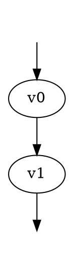

# GammaLoop Drawing Architecture

This document describes the drawing path used by GammaLoop and the DOT syntax
that matters at each layer. The important boundary is:

- GammaLoop owns physics graph data and model-to-style policy.
- Linnet/Linnest owns DOT parsing, half-edge graph shape, layout, and drawing.
- Kurvst owns Bezier splitting, trimming, and path patterns.
- User-authored render templates are an optional drawing feature, not part of
  GammaLoop's generated physics interaction.

## Pipeline

GammaLoop drawing uses the same DOT files that describe the Feynman graphs. A
rendering run has these steps:

1. GammaLoop writes DOT graph files.
2. GammaLoop writes a model-specific `edge-style.typ`. This file maps particle
   names to Typst style dictionaries and exports callbacks named
   `source-style`, `sink-style`, and `edge-label`.
3. The drawing templates in `assets/embedded/drawing/templates/` are copied to
   the drawing build directory. They include `linnest.wasm`, `kurvst.wasm`,
   `linnest.typ`, `curve.typ`, `draw.typ`, `graph.typ`, `subgraph.typ`,
   `figure.typ`, `grid.typ`, and `layout.typ`.
4. The `linnet` CLI compiles `figure.typ` for each DOT file. The figure
   template reads the file through `sys.inputs.data-path` and forwards the DOT
   text to `layout.typ`.
5. `layout.typ` calls `graph.parse`, then `layout`, then `draw`.
6. `draw` calls the generated callbacks from `edge-style.typ`, draws edges and
   labels, then draws nodes last so nodes sit on top of edges.

The normal GammaLoop path does not need evaluated string templates. Generated
particle styles are ordinary Typst dictionaries/functions in `edge-style.typ`.
Evaluated templates exist only so a user can manually edit DOT render fields and
opt into executable Typst at drawing time.

## Components

`crates/gammalooprs`
: Generates physics DOT and the model-specific `edge-style.typ`. It decides how
  a particle should look: photon wave, gluon coil, scalar dashed line, mass
  dependent thickness, labels, and related policy.

`crates/linnet`
: Provides the half-edge graph data structure and DOT parser. Its parser turns
  invisible DOT nodes into dangling half-edges and preserves unconsumed
  attributes as statement dictionaries.

`crates/linnest`
: Provides the Typst-facing wasm plugin and Typst wrappers. It parses DOT into
  graph bytes, lays out node and edge positions, exposes graph queries, and
  provides the CeTZ draw API.

`crates/kurvst`
: Provides the Typst-facing curve wasm plugin. It splits and trims Bezier
  curves, builds Hobby curves through edge layout points, and generates wave,
  zigzag, and coil path patterns.

`crates/clinnet`
: Provides the `linnet` CLI used to batch-render DOT files with Typst and
  assemble grid PDFs.

## Data Ownership

GammaLoop DOT has two kinds of data.

Physics data is read by GammaLoop when a graph is parsed as a physics graph.
Examples are `particle`, `pdg`, `lmb_id`, `num`, `int_id`, and
`overall_factor`.

Drawing data is read by the Linnest drawing templates. Examples are
`display-label`, `label-template`, `source-style`, `sink-style`, endpoint
compass points, and subgraph selections by compass.

The same DOT file may contain both kinds of data for drawing. If a manually
decorated DOT file is later fed back into GammaLoop's physics parser, keep in
mind that drawing-only fields may produce unknown-attribute warnings unless the
physics parser has explicitly whitelisted them. The drawing templates treat
GammaLoop-only physics fields as ordinary metadata unless a callback chooses to
use them.

## DOT Shape

Use DOT `digraph` syntax:



Important parser rules:

- `style=invis` on a node marks that node as a dangling external endpoint. It
  is not a normal drawn node in the half-edge graph.
- An edge from an invisible node to a real node becomes an incoming dangling
  half-edge at the real node.
- An edge from a real node to an invisible node becomes an outgoing dangling
  half-edge at the real node.
- An edge between two invisible nodes is invalid.
- `node:port` and `node:port:compass` are preserved as endpoint data. The port
  becomes the hedge id/port label; the compass is used by drawing subgraphs such
  as `subgraph.compass(g, "e")`.
- `edge [key=value]` and `node [key=value]` defaults are merged into individual
  edges and nodes before GammaLoop or Linnest sees the final statements.
- Attribute values are handled as strings after DOT parsing. Quote complex
  expressions and values containing spaces or punctuation.

## GammaLoop DOT Syntax

GammaLoop expects canonical attribute names. Some older aliases may be mentioned
by warnings, but new DOT should use the names below.

### Graph Attributes

`num`
: Global numerator factor. Default is `1`.

`overall_factor`
: Symbolica expression multiplying the graph. Default is `1`.

`projector`
: Optional projector expression. If omitted, GammaLoop builds the polarization
  projector from external particles.

`params`
: Semicolon-separated Symbolica expressions used as additional parameters.

`group_id`
: Optional graph-group id. Graphs with the same group id are evaluated as one
  group.

`is_group_master`
: Boolean marking the master graph inside a group. If no master is provided,
  GammaLoop chooses one.

Export-only graph attributes include `overall_factor_evaluated`; they are useful
for inspection but are not input knobs.

### Node Attributes

`int_id`
: UFO vertex-rule id. If omitted, GammaLoop infers the vertex rule from the
  oriented incident particles when possible.

`num`
: Explicit vertex numerator. If present, it is used instead of a UFO vertex
  rule.

`dod`
: Degree of divergence override for the vertex.

`name`
: Optional semantic name stored on the parsed vertex. The DOT node id itself is
  still the graph topology handle.

GraphViz-only presentation fields such as `label`, `shape`, `style`, `pos`,
`color`, and `fillcolor` are ignored by GammaLoop's physics parser.

### Edge Attributes

`id`
: Numeric edge id. Linnet consumes this as the internal edge index rather than
  keeping it as a normal edge statement. Drawing callbacks expose the drawn edge
  index as `eid`.

`particle`
: Model particle name, for example `"a"`, `"d"`, `"d~"`, `"g"`, `"ghG"`, or
  `"W+"`.

`pdg`
: Alternative to `particle`; looked up through the model PDG code.

`mass`
: Symbolica mass expression. With `particle`, this overrides the model mass for
  that edge. Without `particle`, it creates a mass-only scalar-like edge.

`dir`
: DOT direction/orientation. `forward` means default orientation, `back` means
  reversed, and `none` means undirected. If omitted, GammaLoop derives the
  orientation from the particle.

`source`
: Endpoint payload for the source half-edge. GammaLoop expects JSON5 when the
  payload carries structured data, for example `source="{ufo_order:2}"`.

`sink`
: Endpoint payload for the sink half-edge, with the same JSON5 convention as
  `source`.

`lmb_id`
: Loop-momentum-basis id for a chosen loop edge.

`is_cut`
: Hedge id used to mark an initial-state cut/external cut.

`num`
: Explicit edge numerator. The parser localizes `edgeid(...)`, `sourceid(...)`,
  and `sinkid(...)` placeholders to the concrete edge and hedge indices.

`dod`
: Degree of divergence override for the edge.

`name`
: Optional semantic edge name.

`is_dummy`
: Boolean marking a dummy edge. Dummy edges are filtered out of some physics
  operations and vertex matching.

`momtrop_edge_power`
: Optional Symbolica expression controlling the momentum power used by the
  momtrop sampler. This does not change the graph topology.

`vakint_edge_power`
: Optional integer controlling the momentum power used by vakint evaluation.
  This does not change the graph topology.

Physics DOT exporters may also write fields such as `lmb_rep`, `dod_autogen`,
`num_autogen`, and `name_autogen`. These are inspection/export metadata, not
normal user input.

## Drawing DOT Syntax

The drawing templates receive the parsed graph after Linnest layout. All
unconsumed DOT statements are available to callbacks as edge or node data.

### Node Data In Drawing

The `draw` callback data for nodes includes:

- `vid`: zero-based node index in the drawn graph.
- `node`: the full node object.
- `name`: the node name.
- every node statement preserved from DOT.

By default, `draw` uses the node name as the label and computes a circle radius
that fits the label. Users can override this in Typst with `node-label` and
`node-style` callbacks.

### Edge Data In Drawing

The `draw` callback data for edges includes:

- `eid`: zero-based edge index in the drawn graph.
- `edge`: the full edge object.
- `source`: source endpoint statement, if present.
- `sink`: sink endpoint statement, if present.
- `source-endpoint`: endpoint object with node, hedge, port, and compass data.
- `sink-endpoint`: endpoint object with node, hedge, port, and compass data.
- `orientation`: `default`, `reversed`, or `undirected`.
- `ext`: boolean, true for dangling half-edges.
- every edge statement preserved from DOT.

GammaLoop's generated `edge-style.typ` uses `particle` to look up the default
edge style. A user can add drawing-only fields without affecting the generated
GammaLoop styles.

### Label Fields

`label-eval`
: Always interpolated and evaluated as Typst content for the edge label. If
  present, it takes precedence over the other label fields.

`label`
: Plain label text by default. In the GammaLoop embedded template, this is used
  only if `display-label` and `label-template` are absent.

`display-label`
: Preferred drawing label template.

`label-template`
: Fallback drawing label template.

Label templates interpolate `{field}` placeholders from the edge callback data:

```dot
a -> b [particle="a", id=7, display-label="{particle} edge {eid}"];
```

Use `{{` and `}}` for literal braces. Unknown placeholders are left unchanged.
The DOT `id` field is consumed as Linnest's stable edge id; draw callbacks expose
that value as `eid`.

### Style Fields

`source-style`
: Drawing-only style fragment for the source half-edge. In plain mode, string
  values are ignored by the generated GammaLoop callback. In eval mode, the
  string is interpolated and evaluated as Typst, and must evaluate to a
  dictionary.

`sink-style`
: Drawing-only style fragment for the sink half-edge, with the same behavior as
  `source-style`.

`source-style-eval`
: Always interpolated and evaluated as a Typst dictionary for the source
  half-edge.

`sink-style-eval`
: Always interpolated and evaluated as a Typst dictionary for the sink
  half-edge.

### Precedence

Source half-edge style is assembled in this order:

1. the generated model style selected by `particle`;
2. `source-style`, evaluated only when `typst-fields` is `"eval"`;
3. `source-style-eval`, always evaluated.

Sink half-edge style is analogous: generated model style, then `sink-style`,
then `sink-style-eval`. Later dictionaries override earlier keys.

Edge labels use the first available value in this order:

1. `label-eval`, always evaluated;
2. `display-label`;
3. `label-template`;
4. `label`;
5. the generated model label.

The normal GammaLoop-generated path does not rely on `*-eval`. These fields are
an escape hatch for manually edited DOT files.

### Interpolation And Templating

String templates are converted to text, outer quotes are trimmed, and then
`{field}` placeholders are replaced from the edge callback dictionary. Escaped
`{{` and `}}` become literal braces. Unknown placeholders remain in the string,
which makes misspelled fields visible in the rendered output or in Typst eval
errors.

Eval fields are interpolated first and evaluated afterward. Their eval scope is
the generated style scope plus the edge callback dictionary, so expressions can
refer to helpers such as `source-stroke`, `sink-stroke`, `wave`, `coil`,
`zigzag`, and to edge fields such as `particle`, `label`, `eid`,
`source-endpoint`, and `sink-endpoint`.

### Eval Mode

The embedded figure template reads `sys.inputs.typst-fields`. The default is
plain mode:

```bash
linnet draw graphs --input typst-fields=plain
```

Plain mode interpolates label templates but does not execute normal render
fields. This keeps generated GammaLoop drawings data-only.

Eval mode is opt-in:

```bash
linnet draw graphs --input typst-fields=eval
```

In eval mode, the known render fields `label`, `display-label`,
`label-template`, `source-style`, and `sink-style` are interpolated and then
passed to Typst `eval`. Explicit `label-eval`, `source-style-eval`, and
`sink-style-eval` fields are evaluated in both modes because their names are
already an opt-in.

Example:

```dot
digraph styled {
  a -> b [
    particle="a",
    id=7,
    display-label="[#text(fill: red)[{particle} edge {eid}]]",
    source-style="(stroke: red + 1.2pt)",
    sink-style="(stroke: blue + 1.2pt)"
  ];
}
```

This requires `--input typst-fields=eval`.

### Pattern Style Dictionaries

Kurvst patterns are selected through Typst style dictionaries, not through a
special physics DOT field. A style dictionary may contain:

- `pattern`: `"wave"`, `"zigzag"`, `"coil"`, `"normal"`, or `"curve"`.
- `pattern-amplitude`
- `pattern-wavelength`
- `pattern-phase`
- `pattern-samples-per-period`
- `pattern-coil-longitudinal-scale`
- `pattern-accuracy`

Style dictionaries may also contain path-geometry keys. These are consumed by
`draw` and are not forwarded to CeTZ:

- `parallel-distance`: normal offset for the half-edge path.
- `parallel-length`: maximum visible arc length for a centered parallel path.
- `parallel-ratio`: maximum visible fraction of the base edge length for a
  centered parallel path.
- `parallel-accuracy`: Kurbo fitting tolerance for the parallel path.
- `parallel-optimize`: whether Kurbo should optimize the fitted path.

`draw` also accepts `edge-parallel-distance`, `edge-parallel-length`,
`edge-parallel-ratio`, `edge-parallel-accuracy`, and `edge-parallel-optimize` as
defaults for both half edges. Parallel paths are computed on the base edge
geometry before patterns and other decorations; node outsets then trim the
shifted path, so it remains shortened at node boundaries. When both length and
ratio limits are set, `draw` uses the shorter centered visible span.

GammaLoop-generated particle styles produce these dictionaries directly. A user
can also produce them through `source-style` or `sink-style` in eval mode:

```dot
a -> b [
  particle="a",
  source-style="(stroke: red + 1pt, pattern: \"wave\", pattern-amplitude: 0.14)",
  sink-style="(stroke: blue + 1pt, pattern: \"coil\", pattern-amplitude: 0.14)"
];
```

## Subgraph Drawing

Subgraph shading is a drawing feature. In Typst, callers can construct a
subgraph and pass it to `draw`:

```typ
#let east = subgraph.compass(layed-out, "e")
#draw(layed-out, subgraph: east)
```

Compass subgraphs use endpoint compass data from DOT ports such as `v:0:e` or
from Typst-built endpoint dictionaries such as `(node: a, compass: "e")`.

`draw` shades included half-edges with `subgraph-edge-style`. By default this
is an underlay, so the normal edge style remains visible on top.

## Practical Guidance

For GammaLoop-generated diagrams:

- Put physics data in canonical GammaLoop fields.
- Let GammaLoop generate `edge-style.typ`.
- Keep `typst-fields` at the default `plain`.
- Do not use `*-eval` fields unless a human is deliberately customizing a
  drawing.

For manually edited drawing DOT:

- Use `display-label` or `label-template` for labels.
- Use `{field}` interpolation to reuse DOT metadata.
- Use `--input typst-fields=eval` only when a render field contains Typst code.
- Prefer drawing-only fields such as `source-style` and `sink-style` over
  changing physics fields such as `particle`, `pdg`, or `mass`.
- Treat drawing-only DOT as a render artifact if those fields are not yet
  accepted by the GammaLoop physics parser.
