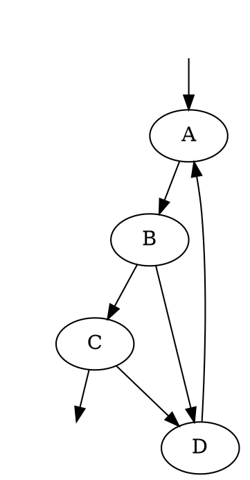

# Scalar amplitude benchmarks for advanced sampling

## Recommendation and checked scope

Start with the massive five-propagator two-loop kite, whose topology already
exists as [double_triangle.dot](../../../tests/resources/graphs/double_triangle.dot).
It is ultraviolet finite, including every subloop, and a scalar numerator
keeps generation inexpensive. Use both a rest-frame threshold-intersection
case and a boosted case. Then add the massive planar double box from
[boxes_2L4P.dot](../../../tests/resources/graphs/boxes_2L4P.dot).

Fresh scratch generation confirmed these are inexpensive real amplitude
fixtures, with generated threshold counterterms and all orientations retained:

| Case | Generation elapsed | Peak RAM | Orientations / LMBs | Existing E-surfaces |
|---|---:|---:|---|---|
| Massive kite, Q=(5,0,0,0), m=1 | about 0.66 s | 139 MiB | 18 / 8 | (3,4), (2,5), (2,4,6), (3,5,6) |
| Massive planar double box, sqrt(s)=6, m=1 | about 4.25 s | 181 MiB | 98 / 15 | (5,7), (8,10), (5,6,10), (6,7,8) |

These timings use the existing debug CLI, eager evaluators, no compilation,
one generation core and no UV subtraction. They are generation measurements,
not integration benchmarks or measurements of the new sampling maps. A fully
threshold-subtracted kite point was also evaluated successfully. Exact files,
settings and evidence are given below. That scratch research changed no tracked
production fixture. The subsequent implementation adds
[massive_kite.dot](../../../tests/resources/graphs/massive_kite.dot) and the
bounded production tests described below.

## Production coverage: initial audit and implementation

The initial audit on 13 September found a production connection missing from
[AmplitudeGraphTerm::compile_sampling_bridge](../../../crates/gammalooprs/src/integrands/process/amplitude/mod.rs),
which supplied the parent frame and settings but left surface geometry empty.
Ordinary/named LMB channels worked; explicit physical surfaces could not compile.
Synthetic supplied-geometry tests did not cover that missing connection.

The following implementation registers explicit full-rank surfaces from the
actual catalogue, warmup masses and external momenta. It resolves sign-reversed
shift counterparts, diagnoses remaining ambiguities, validates the full native
frame/rank, and preserves normalized fallback channels for absent/pinched targets.
Existing surfaces with an unsuitable zero center are rejected. The real kite
test passes rest/boosted root, six-dimensional determinant, inverse and common
partition checks. It exposed and fixed a shared metadata bug: physical energy
edges identify the surface; the fully embedded output uses the common parent
coordinate frame.

Automatic discovery, non-native parent frames and proper subspace/complement
registration remain unfinished. `auto:surfaces` alone still has no registered
amplitude physical-surface candidates to add. There is **no
Cutkosky host, LU rescaling t-star or LU h** in these amplitude benchmarks.
Do not create a second amplitude-specific sampling engine. A two-line surface
which is cylindrical in the full six-dimensional space needs its proper active
three-dimensional block and conditional complement. The kite's three-line
surfaces have genuine six-dimensional dependence. Validate those ranks and
branches instead of pretending every threshold is a six-dimensional sphere.

## Ultraviolet and infrared selection

For a scalar numerator and simple quadratic propagators, a subgraph with L
loops and I internal edges has superficial UV degree `omega=4L-2I`.
Convergence must hold for every loop subgraph, including correlated hard
directions; overall negative degree alone is insufficient.

| Topology | Overall degree | Proper loop subgraphs | Assessment |
|---|---:|---|---|
| Kite/double triangle: L=2,I=5 | -2 | Every simple cycle has at least three edges: omega<=-2. The only two-loop core is the full five-edge graph. | Cheapest genuinely UV-finite coupled two-loop amplitude. |
| Triangle box: L=2,I=6 | -4 | Triangle and box cycles have omega=-2,-4; no two-edge bubble. | Useful inexpensive three-point extension; topology exists in [triangle_box.dot](../../../tests/resources/graphs/triangle_box.dot). |
| Planar double box: L=2,I=7 | -6 | Two elementary box cycles and the six-edge outer cycle have omega=-4,-4,-8. | Stronger multi-leg stress case; also genuinely UV finite. |
| Ordinary sunrise: L=2,I=3 | +2 | Two-edge one-loop subgraphs have omega=0. | Exclude from the UV-finite core suite. |
| Box with self-energy insertion | Often negative overall | The inserted bubble still has omega=0. | Exclude unless testing UV subtraction specifically. |

All internal masses should be one initially. There are then no massless soft
or collinear divergences, which keeps threshold sampling separate from a
second IR research problem. The existing `double_triangle.dot`,
`triangle_box.dot` and `boxes_2L4P.dot` use pdg=1000, namely scalar_0 whose model
mass is ZERO. Merely setting `mass_scalar_1=1` does not make those existing
files massive. The scratch clones below explicitly use scalar_1 for internal
edges and set scalar edge/vertex numerators to one.

A numerator does not generally make a UV-divergent graph safer; polynomial
numerators worsen power counting unless they implement a specifically proved
subtraction. A sunrise with powers (2,2,1) is UV finite because the total power
exceeds four and every two-edge power sum exceeds two. It is a possible later
raised-residue stress test, but it introduces higher poles and offers only one
basic three-body threshold. The simple-propagator kite is a better first test.

## Kite: exact routing and verified threshold intersections

The scratch kite has external edges 0 and 1, and internal edges

```
2: A->B, 3: B->C, 4: C->D, 5: D->A, 6: B->D.
```

The full parent LMB is `[4,6]`. Write `k=q4`, `l=q6`, `p=k+l`; momentum
conservation gives `q3=k+Q`, `q5=p`, `q2=p+Q` and `q6=l`.
Here these equations refer to four-momentum routings; the following E values
use their spatial vectors and positive mass-one on-shell energies.
The four generated existing surfaces are

```
A = E(k+Qsp)+E(k)-Q0                     edges (3,4),   Esurface #2,
B = E(p+Qsp)+E(p)-Q0                     edges (2,5),   Esurface #3,
C = E(p+Qsp)+E(k)+E(l)-Q0                edges (2,4,6), Esurface #6,
D = E(k+Qsp)+E(p)+E(l)-Q0                edges (3,5,6), Esurface #7.
```

These displayed IDs identify graph-group thresholds for the scratch generation;
they are not necessarily positions in the graph's complete CFF E-surface cache
and are not stable user-facing identifiers. Use edge equations and the full
routing in durable channels.
The display's LMB catalogue entry #0=(4,5) is not the master frame: the exported
evaluator's independent parameters remain q4 and q6.

### Rest frame: an intersection inside actual CFF terms

For Q=(5,0,0,0), let `R=sqrt(25/4-1)=sqrt(21)/2`. Then

```
k=(R,0,0), p=(0,R,0), l=p-k=(-R,R,0)
```

gives A=B=0. The two normal vectors in the full (k,l) space have rank two.
At fixed l this is also a regular intersection of two ordinary spheres in
the same k block, since `0<|l|=sqrt(2)R<2R`. A one-normal channel and a joint
two-normal/tangent chart therefore have distinct, meaningful targets.

This is not only a formal intersection of denominators. The stored generated
original CFF expression has both A and B in the same denominator in

- orientation #7: `[0,0,+,+,-,-,+]`, with additional denominator D;
- orientation #16: `[0,0,+,+,-,-,-]`, with additional denominator C.

At the witness C=D=E(l)=sqrt(11.5)>0, so the pair intersection does not hide
a simultaneous third threshold. The amplitude warmup reports one maximal
overlap group containing all four surfaces. The default common full-space
threshold solve remains unchanged when comparing sampling choices.

### Boosted frame: genuinely two-loop surface dependence

Keep the invariant Q^2=25 but use `Q=(sqrt(26),0,0,1)`. Put

```
E0=(sqrt(26)-1)/2,
k=(sqrt(E0^2-5/4),0,-1/2) = (1.7176991131171975,0,-0.5),
l=(0,0,0), p=k.
```

Now C=D=0 and A=B=-1. Their six-dimensional gradient Gram determinant is
0.8361115573581266, so the two normals are independent. The zero l is the
spatial momentum of a **massive** edge, hence not a massless soft singularity.
This is an analytic regular witness for the two coupled three-line equations.
In the rest frame C and D coincide numerically because of the equal masses
and zero external spatial momentum; the boost removes that special geometry.
It also supplies a useful Lorentz-invariance comparison of the final scalar
amplitude. Unlike the A/B witness above, no claim is made that C and D occur
together in a single CFF orientation term.
Scratch boosted-kite generation also succeeded, retaining all four existing
surface edge sets.

## Reproduction from the existing CLI

The executed scratch fixtures/cards and saved states are under
`/tmp/advanced-sampling-amplitude-research/`. To reproduce without relying on
that directory, write the following as a scratch `kite.dot`:



Use this scratch card, changing the graph path to its actual absolute path:

```toml
commands = [
  "import model scalars-default.json",
  "set model mass_scalar_1=1.0",
  "import graphs /tmp/advanced-sampling-amplitude-research/kite.dot -p massive_kite -i default -o",
  "generate existing -p massive_kite -i default",
  "display integrand -p massive_kite -i default",
]
[cli_settings.global.generation]
override_lmb_heuristics=true
[cli_settings.global.generation.uv]
subtract_uv=false
generate_integrated=false
[cli_settings.global.generation.threshold_subtraction]
enable_thresholds=true
check_esurface_at_generation=true
[cli_settings.global.generation.evaluator]
compile=false
store_atom=true
summed=false
summed_function_map=true
iterative_orientation_optimization=false
[default_runtime_settings.general]
evaluator_method="SummedFunctionMap"
integral_unit="none"
[default_runtime_settings.kinematics]
e_cm=5.0
[default_runtime_settings.kinematics.externals]
type="constant"
[default_runtime_settings.kinematics.externals.data]
momenta=[[5.0,0.0,0.0,0.0],"dependent"]
helicities=[0,0]
[default_runtime_settings.subtraction]
disable_threshold_subtraction=false
[default_runtime_settings.sampling]
graphs="summed"
orientations="summed"
sampling_multichanneling=false
sampling_channels="summed"
coordinate_system="spherical"
mapping="linear"
b=1.0
```

The exact successful commands used the existing `target/debug/gammaloop`:

```bash
./target/debug/gammaloop -s /tmp/advanced-sampling-amplitude-research/state \
  /tmp/advanced-sampling-amplitude-research/kite.toml quit
./target/debug/gammaloop -s /tmp/advanced-sampling-amplitude-research/state \
  --read-only-state save standalone --json \
  /tmp/advanced-sampling-amplitude-research/standalone
./target/debug/gammaloop -s /tmp/advanced-sampling-amplitude-research/state \
  --read-only-state inspect -p massive_kite -i default -m \
  -x 2.30 0.10 0.20 -2.28 2.30 0.10 \
  --json-output /tmp/advanced-sampling-amplitude-research/inspect.json
```

Use the configured development environment and Symbolica license as usual.
The finite subtracted inspect returned approximately
`-1.0482180948739044e-10 - 3.7822772909039939e-10 i`.
This is a reproducibility point, not an independent analytic oracle.
The singular spelling `display integrand` is what this binary accepts.

For the boosted case replace the first external momentum by
`[5.0990195135927845,0,0,1]`, retaining e_cm=5 and the dependent second port;
use a distinct state folder. For the double box, the executed scratch
`double_box.dot` is the existing boxes_2L4P topology with external IDs 0..3,
internal IDs 4..10, scalar_1 internal particles and all numerator factors one.
Its full supplied LMB is `[5,8]`, and kinematics are

```
[3,0,0,3], [3,0,0,-3], [3,3,0,0], dependent; e_cm=6.
```

This gives s=36, t=u=-18 with massless external legs and massive internal
lines. Its generated existing surfaces are #9(5,7), #10(8,10),
#18(5,6,10), #19(6,7,8). This confirms thresholds and inexpensive generation;
an explicit same-orientation double-box intersection witness is still a
promotion gate before using it as an intersection benchmark.

## Fair variance comparisons and independent acceptance

Compare the **same fully threshold-subtracted amplitude** with all 18 kite
orientations, fixed masses/externals, unchanged CT metadata and common centers,
and unchanged local/integrated threshold settings. A physical unsubtracted
real-axis amplitude is not a normal Monte Carlo baseline. Use a valid contour
or subtraction if comparing representations, which is a separate task.

Once production graph-surface registration is connected, compare:

1. `auto:optimized_lmb` with exact raw-frame map-density partitions;
2. `auto:lmb`, separating existing channel optimization from the new geometry;
3. a named single A or B shell channel plus ordinary full-support coverage;
4. coupled C/D full-space channels and their mixture with A/B and LMB coverage;
5. the appropriate joint two-normal chart after its generic implementation.

Use the same graph/orientation/channel execution mode in each A/B. Equal
sample counts diagnose estimator variance; equal wall-time budgets diagnose
usefulness after root/inverse-density cost. Record independent seeds, signed
Re/Im means, absolute first/second moments, maximum weights and their complete
raw points, rescue rate and sample time. Keep warmup and production budgets
separate. Threshold CTs may already make these simple scalar cases smooth,
so unchanged or worse variance is a legitimate outcome; require correct
normalization, not an artificial improvement factor in every fixture.

The independent gates are:

- Graph-derived map forward/inverse and Cartesian finite-difference Jacobians
  on the actual generated six-dimensional host, including nonmaster LMB
  routing, shifted centers and absent-fiber branches. Do not replace actual
  surface geometry by a manually supplied sphere in this acceptance gate.
- Gaussian and asymmetric normalized-reference integrals through saved/reloaded
  amplitudes, with exact canonical channel weighting and enough broad coverage
  to make the chosen reference's moments finite. Use the same generic harness
  as cross sections; no Cutkosky or h-function machinery is relevant here.
- Analytic ellipsoid volumes for A/B at fixed complement, and the displayed
  A/B and C/D residual/rank witnesses. Track paired approaches to intersections
  with common-center CT subtraction and compare higher precision where needed.
- UV scaling for each independent and correlated loop direction with UV CTs
  disabled. This supplements the subgraph power-counting proof.
- Euclidean massive-kite comparison against a separate Feynman-parameter
  representation. With five simple propagators in D=4, the parameter integrand
  is proportional to `1/(U F)` on the four-dimensional simplex; match all loop
  measure and numerator conventions before importing a numerical target.
- A massless off-shell Euclidean kite is an additional analytic normalization
  oracle: with each Euclidean loop normalized by d^4k/pi^2, its value is
  `6 zeta(3)/Q_E^2`.[^kite] This is not the massive above-threshold test and
  does not carry the same IR or threshold geometry. Convert the amplitude's
  contour, propagator and `(2pi)` conventions explicitly.
- Lorentz-invariant equality of rest/boosted scalar amplitudes at the same
  Q^2, with the same subtraction prescription; crossing/routing checks for
  the planar double box are useful later.

The existing six-photon two-loop graph remains an eventual realistic stress
test, but its spin/tensor numerators and generation setup are unnecessary
cost for validating generic threshold geometry. The associated
[2l_eu.toml](../../../tests/resources/run_cards/photonic_amplitudes/2l_eu.toml)
also deliberately uses heavy internal tops and disables threshold subtraction,
so it is not already an above-threshold acceptance case.

## Bounded next implementation slice

First register only explicitly named full-rank amplitude surface targets in
the existing `AmplitudeGraphTerm::compile_sampling_bridge` owner. Resolve each
against `self.esurfaces`, including the external shift; reject ambiguous edge
sets. Reuse `self.real_mass_vec`, populated by the existing graph-term warmup,
and the external four-vectors passed to this method. Invoke
`Esurface::sampling_radial_map` and insert the resulting evaluator into the
existing compile context. No new map trait, host state or channel enumeration
is required.

For the first regression choose the kite C surface `(2,4,6)` with the full
parent/active LMB `[4,6]`. Its routed momenta include k and l separately, so
the stacked active routing has rank two and its six-dimensional body is
bounded. At the selected above-threshold rest and boosted kinematics the
origin is strictly inside, meeting the current kernel's zero-center contract.
Exercise production compilation, root residuals, inverse density and an
independent finite-difference determinant, then the saved-amplitude Gaussian
acceptance through the existing common harness. Assert that the actual C
equation is zero at the chart's reported shell. Cover the absence branch at a
below-threshold external energy too.

Only after that connection passes should the next slice add true active
subspaces and sampled complements for A/B, alternative interior centers,
automatic surface discovery/coverage and intersection charts. Registering a
full six-dimensional test C surface does not establish any of those features.
Do not feed a synthetic constant-radius sphere into the production graph test
or silently promote a rank-deficient two-line full-space target.

### Exact owners, lookup and runtime guards

The first source edit belongs in
`crates/gammalooprs/src/integrands/process/amplitude/mod.rs`, in the existing
`GraphTerm::compile_sampling_bridge` implementation. It should register only
explicit top-level `surface(...)` definitions. Preserve the existing common
`compile_sampling_channel_bridge_with_external` call, canonical IDs and
partition. Broader `auto:surfaces` discovery is a separate slice.

1. Require the definition's parent and active subspace to equal the full
   ordered master parent. Check that the physical graph's actual LMB agrees
   before using its callback, including the complete internal/external routed
   signatures and external-edge ordering: equality of selected loop-edge names
   alone does not identify the cycles. The multi-channel setup of a non-master
   graph can carry a different master graph. Proper subspaces, reordered native
   frames and their spectator contexts require the later embedding work.
2. Read the complete `self.esurfaces` catalogue, selecting the requested
   sorted energy-edge set. The cache contains both negative and positive
   external-energy-shift counterparts. At the current external kinematics,
   an energy sum with a nonnegative constant shift cannot have a regular
   threshold. Exclude these counterparts before checking ambiguity; rejecting
   every different raw shift would reject ordinary kite targets. Collapse
   identical canonically routed shifts. If several distinct negative shifts
   remain, report the channel, graph, all candidate catalogue IDs, edge set,
   shift coefficients, evaluated shifts and routed equations. Do not silently
   choose the first candidate, or collapse shifts merely because they happen
   to have the same numerical value at this point.
3. Diagnose an unknown edge set separately from a known surface that is absent
   or pinched at the supplied kinematics. A known absent target keeps its
   canonical channel and the existing rootless radial fallback. Selection
   must not depend only on enabled CTs or currently existing-threshold flags,
   because that would remove a valid fallback when the external energy drops
   below threshold.
4. Build the integer matrix of selected energy-edge internal signatures. Reuse
   `three_dimensional_reps::utils::rank_i64`, already used elsewhere in this
   repository, and require rank equal to the parent loop count. Include the
   rows, rank, required rank and parent in the rejection diagnostic. For the
   kite C, rows include independent k and l; A has rank one and must fail when
   requested as a full six-dimensional chart.
5. Use the existing E-surface existence classifier to distinguish true absence
   from an existing body whose interior does not contain zero. The current
   `ImplicitSurfaceRadialMap::root_for_direction` returns its rootless branch
   when the origin value is nonnegative. Thus an existing surface outside the
   zero center needs an explicit unsupported-center diagnostic in this slice,
   rather than silently presenting that branch as successful surface focusing.
   The rest/boosted kite C fixtures satisfy the strict-interior condition.
6. Require the existing warmup mass cache, and validate all external four-vectors
   for finiteness and against the full `LoopMomentumBasis::ext_edges` count.
   These are full external vectors, including the dependent one. Reuse the
   existing graph-routed `Esurface::sampling_radial_map`; insert its map through
   `SamplingChannelCompileContext::insert_implicit_surface`. The proposal is an
   explicit f64 boundary; subsequent integrand rescue precision remains intact.

Compilation currently happens when parametrizing each sample, and also when
inverting direct-momentum channel input. Each callback captures fresh external
vectors, settings, routing and warmed masses. Do not add a persistent cache in
this first slice. A model change already requires warmup to refresh
`real_mass_vec`; tests must exercise that contract. A later warmup cache needs
invalidation for model/masses, all external components, parent routing, channel
definitions, profile parameters and relevant orientation selectors. Changing
only e_cm is insufficient to identify the external kinematics.

### Production acceptance matrix

Promote the modern scalar kite fixture above into the existing test-resource
graph directory when implementation starts. Use the existing graph import and
generation APIs in an API state test; no new fixture-building abstraction is
needed. Keep the unchanged, fully threshold-subtracted generated amplitude for
the physical comparison. Test the following through its production bridge:

- Rest and boosted C maps: exact routed shell residual, forward/inverse
  agreement, positive finite Jacobian, and an independent six-dimensional
  Cartesian finite-difference determinant at points away from chart seams.
- C plus D plus an ordinary LMB: canonical channel IDs and partition sum,
  evaluating every inverse score at the same mapped physical point. Do not
  compare scores at different channel images of one cube point.
- Save/reload and warmup of the generated amplitude: the existing Gaussian
  reference harness must recover normalization one and the known momentum
  second moment. Use its discrete-channel entry point where the current
  summed-moment harness cannot retain the individual mapped momenta.
- Below the three-particle threshold, then restored above it: retained channel
  identity, valid fallback/inverse/Jacobian and recovery of surface focusing.
  Repeat after changing a nontrivial external spatial component, and after
  changing a mass followed by warmup, to exclude stale captured kinematics.
- Missing warmup, malformed external dimensions/nonfinite components, unknown
  surface, conflicting negative shifts, rank-one A requested in six dimensions,
  mismatched parent and a proper active subspace: meaningful clean diagnostics.

Existing abstract implicit-map tests remain useful unit coverage, but supplying
one of their spherical callbacks directly does not satisfy any of the
graph-derived production acceptance gates above. The bounded slice makes no
change to threshold CT subspaces, maximal overlap or common centers and has no
LU rescaling variable.

[^kite]: D. J. Broadhurst, *Massless scalar Feynman diagrams: five loops and
    beyond*, original 1985 manuscript, [arXiv transcription](https://arxiv.org/pdf/1604.08027),
    Sec. 2 and its stated Euclidean loop-measure conventions. The two-loop
    member has coefficient binomial(4,2) zeta(3).
